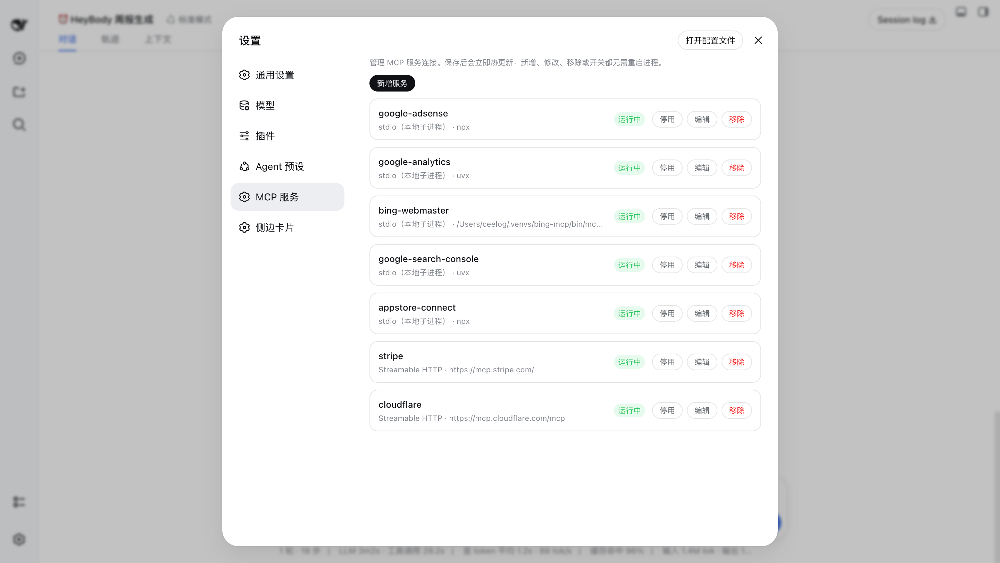

# @opendsh/dsh-plugin-setting-mcp

English | [中文](README.zh.md)

DSH web plugin: **manage MCP servers from the settings panel**. View, edit, remove,
enable, and disable MCP servers, then **Save** — the change hot-reloads immediately
(no process restart), because each server is a live `@deepseek-ai/dsh-mcp-client`
loader entry.



## What it does

- **View** — lists every configured MCP server with its `serverName`, transport
  (stdio / Streamable HTTP), command or URL, and live state (enabled / disabled,
  plus the connection phase: `active`, `failed`, `loading`, …).
- **Add / Edit** — full editor for a server: `serverName`, transport, `command`
  - `args` + `cwd` + `env` (stdio), or `url` + `headers` (HTTP), plus the
    per-call timeout and the `failOnStartupError` flag.
- **Remove** — deletes the server's loader entry (with a confirm prompt).
- **Enable / Disable** — toggles the entry's `disabled` flag without touching
  its config, so a disabled server keeps its full configuration.
- **Save → hot reload** — edits are staged locally; **Save** reconciles the
  loader tree (`create` / `update` / `remove`), then writes the server set back
  to the profile's `cordis.patch.yml` (the durable patch layer). Each operation
  restarts only the affected `dsh-mcp-client` instance, which is the same
  hot-swap the harness HMR performs.

## Architecture

A dual-face npm package installed into the `web` profile:

| Half     | Entry           | Role                                                                                                                                                       |
| -------- | --------------- | ---------------------------------------------------------------------------------------------------------------------------------------------------------- |
| Server   | `lib/index.js`  | Cordis plugin (`inject: ["loader"]`): mounts the `ctx.mcp` typert service that projects and reconciles the loader's `@deepseek-ai/dsh-mcp-client` entries. |
| Protocol | `lib/typert.js` | Host TYPERT face (`mcp/list`, `mcp/save`), auto-registered by `dsh-typert-loader`.                                                                         |
| Browser  | `lib/client.js` | React page mounted into the `settings.section` slot; calls the host through the installed `remote.mcp` namespace.                                          |

The client↔server channel is the DSH typert protocol: strict zod codecs validate
every argument and result on both sides.

## Install

```sh
dsh plugin --profile web add @opendsh/dsh-plugin-setting-mcp
```

## How it maps to `cordis.patch.yml`

The plugin manages the `dsh-mcp-client` rows in the profile's `cordis.patch.yml`
(the user patch layer — **not** `cordis.yml`, which the launcher resets to an
empty list on every boot). A stdio server is the same as:

```yaml
# cordis.patch.yml
- insert:
    - id: mcp-github
      name: "@deepseek-ai/dsh-mcp-client"
      config:
        serverName: github
        transport: stdio
        command: npx
        args: ["-y", "@modelcontextprotocol/server-github"]
        env:
          GITHUB_TOKEN: ...
```

and a Streamable HTTP server is the same as:

```yaml
# cordis.patch.yml
- insert:
    - id: mcp-web
      name: "@deepseek-ai/dsh-mcp-client"
      config:
        serverName: web
        transport: streamable-http
        url: http://localhost:3000/mcp
        headers:
          Authorization: ...
```

The tool names the model sees stay server-qualified (`mcp__<serverName>__<tool>`),
exactly as with hand-written entries.

## Development

```sh
pnpm install --ignore-workspace
pnpm build
pnpm test
```

## Known limitations

- **`reconnect` is not surfaced by the editor.** A disabled/enabled toggle and
  edits to other servers keep the stored `reconnect` block; the editor itself
  cannot view or change it.
- **Advanced `reconnect` fields and future MCP capabilities** (resources,
  prompts) are out of scope for this panel; they remain configurable directly in
  `cordis.patch.yml`.
- **Save is a reconcile, not a transaction.** Operations apply sequentially; if
  a later entry fails (e.g. the server process can't start), earlier operations
  are already applied and the failure is reported in the panel.
